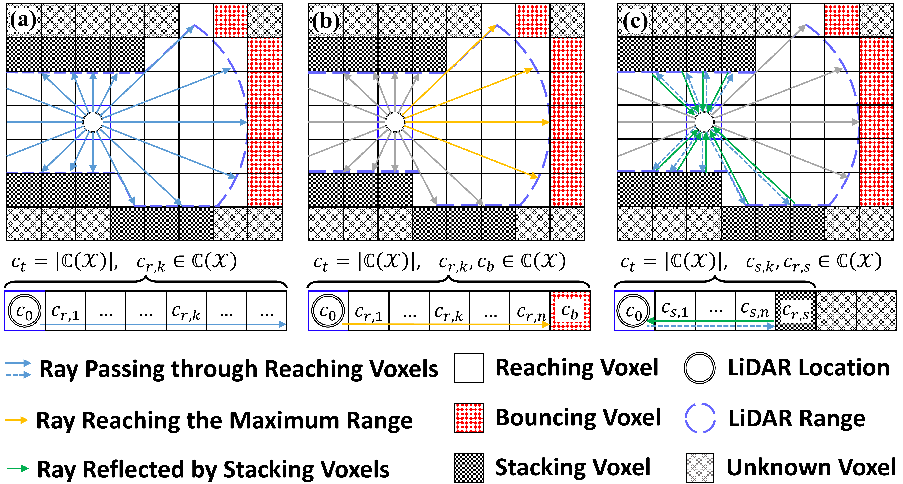
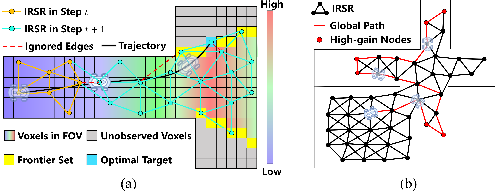
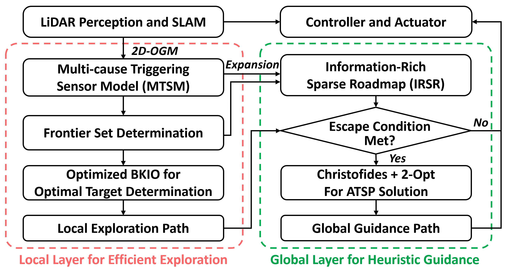

<p align="center">
<h1 align="center">TIPS: Tiered Information-Rich Planning Strategy for Efficient AGV Autonomous Exploration</h1>
<h3 class="is-size-4 has-text-weight-bold" style="color: orange;" align="center">
    IEEE Robotics and Automation Letters, 2025
</h3>
  <p align="center">
    <a href="https://scholar.google.com/citations?hl=zh-CN&user=G8sNV64AAAAJ" target="_blank"><strong>Zhuoxuan Wang</strong></a>
    ·
    <a href="https://orcid.org/0000-0003-0724-9020" target="_blank"><strong>Shuguo Pan</strong></a>
    ·
    <a href="https://orcid.org/0009-0007-5085-4791" target="_blank"><strong>Jinle Xu</strong></a>
    ·
    <a href="https://orcid.org/0000-0002-1030-0678" target="_blank"><strong>Xianlu Tao</strong></a>
    ·
    <a href="https://orcid.org/0000-0002-4856-2454" target="_blank"><strong>Wang Gao</strong></a>
    ·
    <a href="https://orcid.org/0000-0001-5111-9341" target="_blank"><strong>Qiang Wang</strong></a>
    <br>
  </p>
</p>

## 📖 Abstract
We propose a tiered systematic framework to enhance the overall efficiency and environmental coverage of autonomous exploration for Autonomous GroundVehicle (AGV) in complex environments with narrow regions. At the local level, we introduce a novel Multi-cause Triggering Sensor Model (MTSM) to improve informative observation acquisition in narrow regions. Furthermore, the Frontier set is defined from a probabilistic distribution perspective and utilized to optimize the initial training pool of Bayesian optimization, thereby accelerating convergence toward the optimal navigation target point. At the global level, we incrementally maintain an Information-Rich Sparse Roadmap (IRSR) by leveraging accumulated historical exploration knowledge. When a dead zone situation is detected, the heuristic guidance is activated and realized by graph search considering information content and distance between IRSR vertices, enabling AGV to maintain a continuous and sustained exploration process.

<!-- <p align="center">
  
    &nbsp;&nbsp;&nbsp;  &nbsp;&nbsp;&nbsp;
  
</p> -->

<p align="center">
  
  <br>
  <strong>Fig.1.</strong> The flow chart of the proposed framework.
  <br><br>
    
  
  <br>
  <strong>Fig.2.</strong> An illustration of MTSM in an FoV with multiple rays. (a) Rays pass Reaching voxels, Tc(R) is triggered. (b) Rays reach Bouncing voxels at the maximum distance zmax, Tc(R) and Tc(B) are triggered. (c) Rays reflected by Stacking voxels, Tc(R), Tc(B) and Tc(S), are triggered.
  <br><br>

  
  <br>
  <strong>Fig.3.</strong> Schematic of IRSR. (a) Optimal target determination and expansion of IRSR. The heatmap represents the amount of information contained in each voxel. (b) Heuristic global guidance based on IRSR.</em>
</p>


## 🔗 Paper Link 
[TIPS: Tiered Information-Rich Planning Strategy for Efficient AGV Autonomous Exploration](https://ieeexplore.ieee.org/abstract/document/11214391)

## 🎥 Demonstration Video 
Please Check out our demonstration video on [YouTube](https://www.youtube.com/watch?v=0_vi6ks_7sw):

[](https://www.youtube.com/watch?v=0_vi6ks_7sw)

## 🧩 Source code
We are preparing the code for public release with cleanup and reorganization to ensure quality. The release is planned for the first half of 2026. Thank you for your understanding and support.

## ✒️ Citation
Please cite our paper if you think our work is useful to your scientific research:
```
@ARTICLE{wang2025tips,
  title={TIPS: Tiered Information-Rich Planning Strategy for Efficient AGV Autonomous Exploration},
  author={Wang, Zhuoxuan and Pan, Shuguo and Xu, Jinle and Tao, Xianlu and Gao, Wang and Wang, Qiang},
  journal={IEEE Robotics and Automation Letters}, 
  year={2025},
  volume={10},
  number={12},
  pages={12764-12771},
}
```
## 🔈 Acknowledgements
